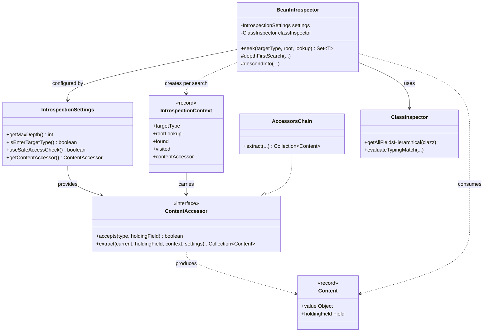
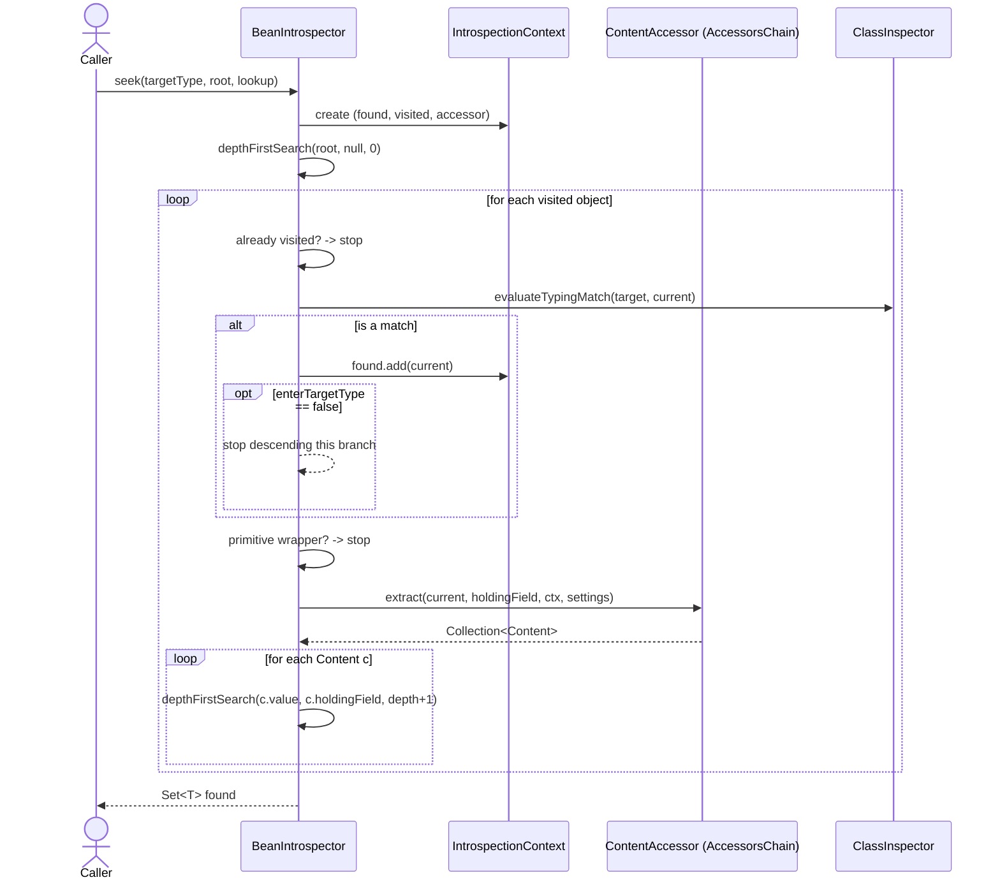

# BeanIntrospector

`BeanIntrospector` is a **recursive object-graph scanner**. Given a *root* object and a *target
type*, it walks the entire reachable object graph and returns every instance of the target type that it finds.

It is the entry point of the Helius Commons reflection toolkit. Everything else described in this
document exists to support it.

- Package: `systems.helius.commons.reflection`
- Primary method: [`seek(Class<T>, Object, Lookup)`](#the-seek-method)

---

## Table of contents

- [When to use it](#when-to-use-it)
- [Quick start](#quick-start)
- [The `seek` method](#the-seek-method)
- [Configuration with `IntrospectionSettings`](#configuration-with-introspectionsettings)
- [How it works](#how-it-works)
  - [Component overview (class diagram)](#component-overview-class-diagram)
  - [A single search (sequence diagram)](#a-single-search-sequence-diagram)
- [Key concepts](#key-concepts)
- [Important collaborators](#important-collaborators)
- [Error handling](#error-handling)
- [Guarantees](#guarantees)

---

## When to use it

Use `BeanIntrospector` when you need to find instances of a type buried somewhere inside an
arbitrary object you do not control or whose structure you do not know at compile time. Typical
scenarios:

- Collecting every `String`, ID, or entity instance nested inside a complex DTO tree.
- Reflective test assertions (e.g. "every `Foo` in this structure was populated").
- Framework-level traversal of user-supplied objects.

If you already know the exact path to the value you want, plain field access will be faster and
simpler. `BeanIntrospector` shines when the path is unknown, deep, or variable.

---

## Quick start

```java
import systems.helius.commons.reflection.BeanIntrospector;
import java.lang.invoke.MethodHandles;
import java.util.Set;

// Find every Integer reachable from `myObject`.
Set<Integer> ints = new BeanIntrospector()
        .seek(Integer.class, myObject, MethodHandles.lookup());
```

> Always pass `MethodHandles.lookup()` created **at your call site**. The lookup carries your
> module's access rights, which the introspector uses to read private fields legally. See
> [Access & lookups](#access--lookups).

Searching for a primitive type works too — primitives are matched precisely, separate from their
wrapper types:

```java
// Matches `int` fields, NOT Integer fields.
Set<Integer> primitiveInts = new BeanIntrospector()
        .seek(int.class, myObject, MethodHandles.lookup());
```

---

## The `seek` method

```java
public <T> Set<T> seek(Class<T> targetType, Object root, Lookup context)
        throws IntrospectionException
```

| Parameter    | Meaning                                                                                  |
|--------------|------------------------------------------------------------------------------------------|
| `targetType` | The type to look for. Matches the type itself and any subtype (covariant match).         |
| `root`       | The object to search inside of.                                                          |
| `context`    | The caller's `MethodHandles.Lookup`. Should always be `MethodHandles.lookup()`.          |

**Returns** a `Set<T>` of all matching instances.

> **WARNING: Identity semantics:** The returned set uses reference identity (`==`), **not** `equals()`.
> Two distinct-but-equal instances are *both* returned; the same instance reached by two different paths is returned *once*.
dfu0
---

## Configuration with `IntrospectionSettings`

A `BeanIntrospector` is configured once at construction time through `IntrospectionSettings`. If
none is supplied, sensible defaults are used.

```java
import systems.helius.commons.reflection.*;

var settings = IntrospectionSettings.builder()
        .withMaxDepth(10)             // stop descending after 10 levels
        .withEnterTargetType(false)   // don't search into matches
        .withSafeAccessCheck(true)    // skip values that can't be legally accessed
        .build();

var introspector = new BeanIntrospector(settings);
```

| Setting           | Default             | Effect                                                                                          |
|-------------------|---------------------|-------------------------------------------------------------------------------------------------|
| `maxDepth`        | `Integer.MAX_VALUE` | Maximum recursion depth from the root.                                                          |
| `enterTargetType` | `true`              | If `true`, instances of the target type are also searched for more matches inside them.         |
| `safeAccessCheck` | `true`              | If `true`, values that cannot be legally accessed are skipped. If `false`, they raise an error. |
| `contentAccessor` | default chain       | The strategy used to read the contents of each object (see [How it works](#how-it-works)).      |

You may also supply your own `ClassInspector` (e.g. a shared cache):

```java
var introspector = new BeanIntrospector(settings, new CachingClassInspector());
```

---

## How it works

At its core, `BeanIntrospector` is a **depth-first search (DFS)** over an object graph. For each
object it visits it asks a single question: *"how do I read the values inside this object?"* and
delegates the answer to a `ContentAccessor`.

The introspector itself does **not** know how to read a `Map`, an array, or a plain bean. It only
knows how to:

1. Decide whether the current object is a match.
2. Avoid revisiting objects (cycle protection).
3. Ask the configured `ContentAccessor` for the object's contents.
4. Recurse into each returned value.

### Component overview (class diagram)



> The default `ContentAccessor` is an `AccessorsChain`, which delegates to specialized accessors
> (arrays, iterables, maps, plain beans). `AccessorsChain` is the single source of all usable
> accessors for the introspector, but **how** it picks the right accessor for a given input is an
> implementation detail that is expected to evolve. Treat it as a black box that, given an object,
> returns the right way to read its contents.

### A single search (sequence diagram)



---

## Key concepts

### Matching

`BeanIntrospector` delegates the "is this a match?" decision to
`ClassInspector.evaluateTypingMatch(...)`. This handles two subtleties:

- **Covariance:** a search for `Number` will match `Integer`, `Long`, etc.
- **Primitive vs wrapper:** because Java autoboxes primitives when passing them as `Object`, the
  introspector uses the *declaring field's* type to tell a real `int` apart from a real `Integer`.
  Searching `int.class` will not return values that were declared as `Integer`, and vice versa.

### Cycle protection

Every visited object is recorded in an identity-based `visited` set. Reference cycles (A → B → A)
and shared instances are therefore handled safely: each object is processed at most once.

### Depth

Recursion stops once `depth >= maxDepth`. The root is at depth `0`, its direct contents at depth
`1`, and so on.

### Access & lookups

To read private fields legally under the Java module system, the introspector needs a privileged
`MethodHandles.Lookup`. You provide the starting point by passing `MethodHandles.lookup()` to
`seek`. Internally, `LookupManager` upgrades that lookup to a private-level lookup for each class it
needs to read, falling back through the lookups it has available.

If a value genuinely cannot be accessed:

- with `safeAccessCheck = true` (default), it is **skipped**;
- with `safeAccessCheck = false`, the failure is raised as an `IntrospectionException`.

Classes that have a specialized `ContentAccessor` that do not rely on `VarHandle` or `MethodHandles` to read
their contents are not subject to this access check, as they are expected to be written in a specific and safe manner.

---

## Important collaborators

| Type                       | Role                                                                                                       |
|----------------------------|------------------------------------------------------------------------------------------------------------|
| `IntrospectionSettings`    | Immutable, builder-created configuration for a search.                                                     |
| `IntrospectionContext<T>`  | Per-search record carrying the target type, root lookup, `found` set, `visited` set, and content accessor. |
| `ClassInspector`           | Inspects a class's field hierarchy and performs type-match logic. `CachingClassInspector` memoises it.     |
| `ContentAccessor`          | Strategy interface: "extract the inner values of this object." See the per-accessor docs.                  |
| `AccessorsChain`           | The default `ContentAccessor`; the registry/source of all built-in accessors.                              |
| `Content`                  | A record `(Object value, Field holdingField)` — one unit of work passed back to the DFS loop.              |
| `LookupManager`            | Acquires privileged `MethodHandles.Lookup` instances for target classes.                                   |
| `ChainComponentException`  | Raised by an accessor when extraction fails; carries an `allowFallback` flag.                              |
| `TracedAccessException`    | Internal exception accumulating the field path to a fatal access error.                                    |
| `IntrospectionException`   | Public checked exception thrown by `seek` on fatal failures.                                               |

The built-in accessors are documented individually:

- [`FieldHandlesAccessor`](accessors/FieldHandlesAccessor.md) — plain objects / beans
- [`ArrayAccessor`](accessors/ArrayAccessor.md) — arrays (primitive & object)
- [`IterativeAccessor`](accessors/IterativeAccessor.md) — `Iterable` collections
- [`IterativeMapAccessor`](accessors/IterativeMapAccessor.md) — `Map` keys & values

---

## Error handling

`seek` throws a single checked exception, `IntrospectionException`, and only when a failure is
**fatal** (i.e. `safeAccessCheck` is disabled and a value could not be accessed). The exception
wraps a `TracedAccessException`, which records the chain of fields traversed to reach the failure so
the message can describe the path that caused it.

```java
try {
    Set<String> result = introspector.seek(String.class, root, MethodHandles.lookup());
} catch (IntrospectionException e) {
    // e wraps the traced path leading to the inaccessible value
    log.error("Introspection failed", e);
}
```

With the default settings (`safeAccessCheck = true`), inaccessible values are silently skipped and
`seek` does not throw for access reasons.

---

## Guarantees

- **Identity, not equality.** The result `Set` compares by `==`.
- **Provide your own lookup.** Always pass `MethodHandles.lookup()` from your own code, not a cached
  or foreign lookup, or you may lose access to fields you are entitled to read.
- **Primitives are precise.** `int.class` and `Integer.class` are different searches.
- **`enterTargetType` controls recursion into matches.** Leave it `true` to find matches nested
  inside other matches; set it `false` to treat a match as a leaf.
