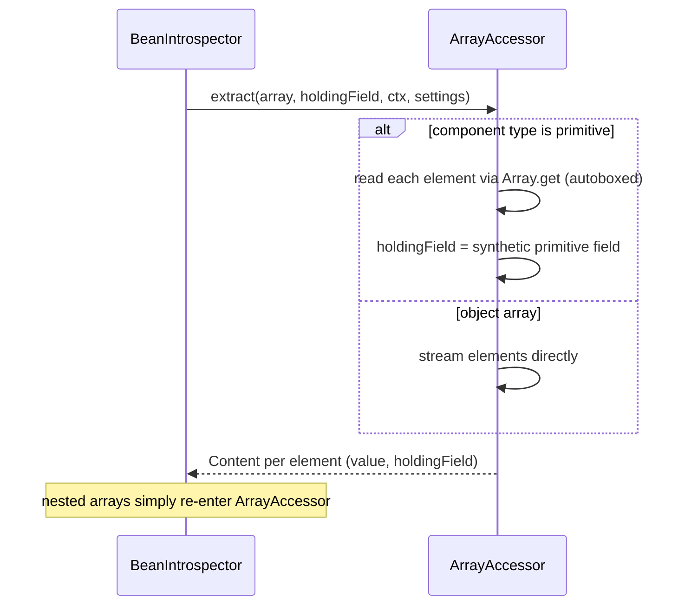

# ArrayAccessor

`ArrayAccessor` is the accessor specialized for arrays — both object arrays (`Foo[]`) and
primitive arrays (`int[]`, `long[]`, …), including multi-dimensional arrays.

- Package: `systems.helius.commons.reflection.accessors`
- Accepts: any class where `Class.isArray()` is `true`.

---

## What it extracts

The accessor yields one `Content` per array element. The behaviour differs slightly depending on
whether the array's component type is primitive:

- **Object arrays** (`Foo[]`, `String[][]`, …): each element is streamed directly and paired with the
  array's `holdingField`. For multi-dimensional arrays, the elements are themselves arrays, so the
  introspector simply re-enters `ArrayAccessor` on each sub-array — recursion handles any number of
  dimensions naturally.
- **Primitive arrays** (`int[]`, `long[]`, …): each element is read via `java.lang.reflect.Array`
  (which autoboxes it) and paired with a **synthetic primitive field**. This synthetic field tells
  the introspector the element's true primitive type, so a search for `int.class` matches `int[]`
  elements while a search for `Integer.class` does not.



---

## Why the synthetic field matters

When a primitive is passed around as an `Object`, Java autoboxes it, erasing the distinction between
the primitive value and its wrapper type (e.g.: `int` -> `Integer`). The introspector decides matches based on the declaring field's type, but
array elements have no declaring field. `ArrayAccessor` therefore substitutes a synthetic field
(`SyntheticPrimitiveFields`) of the correct primitive component type, preserving precise
primitive-vs-wrapper matching.

```java
// Given int[] arr inside `root`:
Set<Integer> ints     = introspector.seek(int.class, root, lookup());      // matches arr elements
Set<Integer> wrappers = introspector.seek(Integer.class, root, lookup());  // does NOT match arr elements
```

---

## Behaviour summary

- Accepts every array type (object and primitive).
- Yields one `Content` per element.
- Handles multi-dimensional arrays through ordinary recursion.
- Preserves precise primitive typing via synthetic primitive fields.
- Does not read the array object's own fields (length, etc.) — only its elements.
