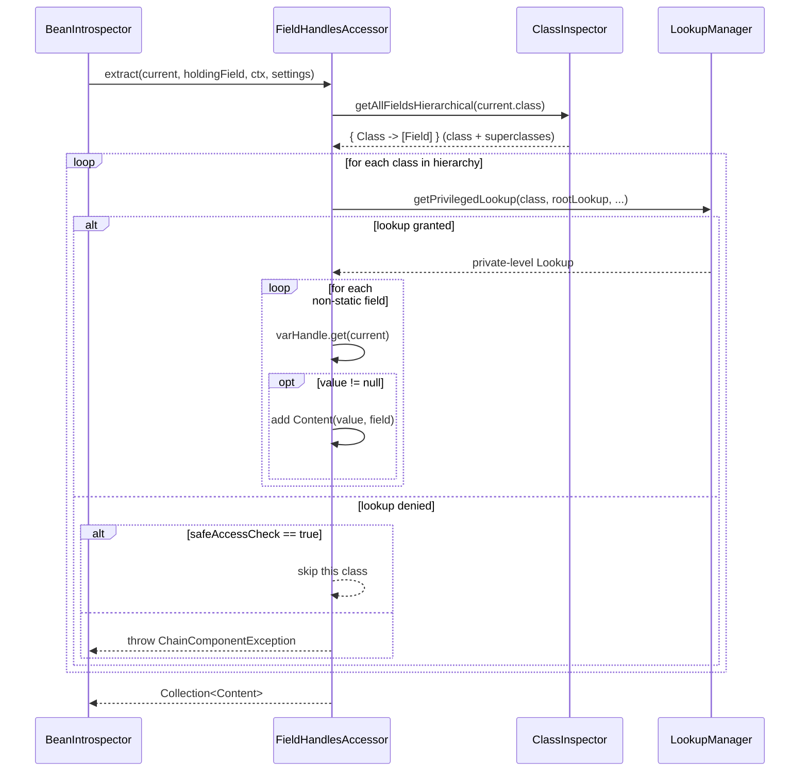

# FieldHandlesAccessor

`FieldHandlesAccessor` is the general-purpose, last-resort accessor. It accepts any object and
reads all of its instance fields, including private fields declared in superclasses, using
`VarHandle`s obtained through the Java `MethodHandles` API.

- Package: `systems.helius.commons.reflection.accessors`
- Accepts: **every** class (`accepts(...)` always returns `true`).
- Role in the default chain: the **last resort** — used when no more specialized accessor (array,
  iterable, map) applies.

---

## What it extracts

For the current object, the accessor:

1. Asks its `ClassInspector` for the full field hierarchy (`getAllFieldsHierarchical`), i.e. the
   declared fields of the class **and all of its superclasses** (excluding `Object`/`Enum`).
2. Acquires a privileged `MethodHandles.Lookup` for each class in the hierarchy via the
   `LookupManager`, so private fields can be read legally.
3. Reads each field's value with a `VarHandle`, skipping:
    - **static** fields, and
    - fields whose value is **`null`**.
4. Returns one `Content(value, field)` per readable, non-null instance field.



---

## Access & safe mode

Reading private fields requires a privileged lookup for each declaring class. The accessor obtains
these through `LookupManager`, starting from the root lookup passed to `seek`.

When a lookup or a field read cannot be performed, behaviour depends on
`IntrospectionSettings.useSafeAccessCheck()`:

| `safeAccessCheck` | Behaviour on inaccessible field/class                                |
|-------------------|----------------------------------------------------------------------|
| `true` (default)  | The offending field/class is **skipped**; extraction continues.      |
| `false`           | A `ChainComponentException` is thrown (wrapping the access failure). |

This is why providing your own `MethodHandles.lookup()` matters: it determines which classes the
accessor is entitled to read.

---

## `ClassInspectorAware`

`FieldHandlesAccessor` implements `ClassInspectorAware<FieldHandlesAccessor>`. This lets the
surrounding `AccessorsChain` swap in a shared `ClassInspector` (typically a `CachingClassInspector`)
so field-hierarchy lookups are cached across the whole search. Therefore, if the dev swaps the class inspector during customization of the access chain,
all accessors will share the same inspector.

```java
FieldHandlesAccessor accessor =
        new FieldHandlesAccessor(new ClassInspector(), new LookupManager());

// returns a NEW accessor wired to the supplied inspector; the LookupManager is preserved
FieldHandlesAccessor shared =
        accessor.replaceClassInspector(new CachingClassInspector());
```

`replaceClassInspector` returns a **new** instance rather than mutating the existing one.


---

## Behaviour summary

- Reads inherited private fields across the whole class hierarchy.
- Skips `static` fields.
- Skips `null`-valued fields (nothing to descend into).
- Honours `safeAccessCheck` for inaccessible members.
- `replaceClassInspector` yields a new accessor sharing the same `LookupManager`.

