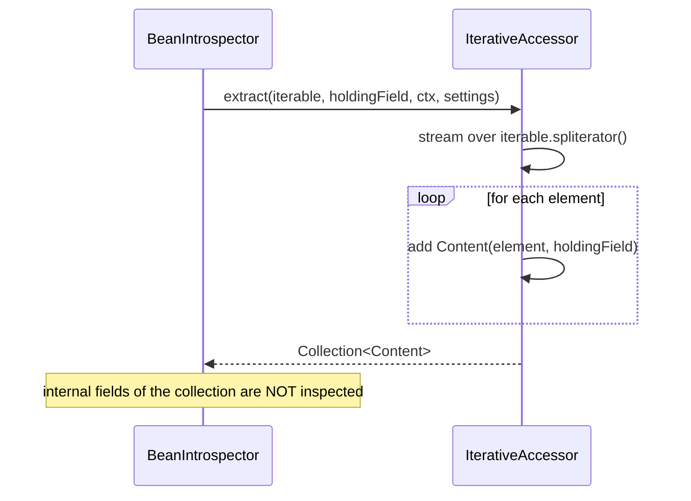

# IterativeAccessor

`IterativeAccessor` is the accessor specialized for `Iterable` objects — `List`, `Set`, `Queue`,
and any other type that implements `java.lang.Iterable`.

- Package: `systems.helius.commons.reflection.accessors`
- Accepts: any class assignable to `Iterable`.

---

## What it extracts

The accessor iterates the collection and yields **one `Content` per element**, each paired with the
collection's own `holdingField`.

Crucially, it treats the collection as a *container of elements*, **not** as a regular object: it
does **not** read the collection's internal fields (backing array, size counter, modification count,
etc.). This keeps results clean — you get the logical contents, not the implementation internals.



---

## Example

```java
record Box(List<String> labels) {}

Box box = new Box(List.of("a", "b", "c"));

Set<String> labels = introspector.seek(String.class, box, MethodHandles.lookup());
// -> { "a", "b", "c" }  (the List's internal fields are ignored)
```

---

## Relationship to other accessors

- For maps, use [`IterativeMapAccessor`](IterativeMapAccessor.md) instead — a `Map` is not an
  `Iterable`, and you usually want both keys and values.
- For arrays, use [`ArrayAccessor`](ArrayAccessor.md) — arrays are not `Iterable`.

Whether iterables are iterated (versus deeply field-inspected) is controlled when building the
accessor chain via `AccessorsChain.Builder.iterateOverIterables(boolean)`.

---

## Behaviour summary

- Accepts any `Iterable`.
- Yields one `Content` per element.
- Does **not** inspect the collection's own fields.

