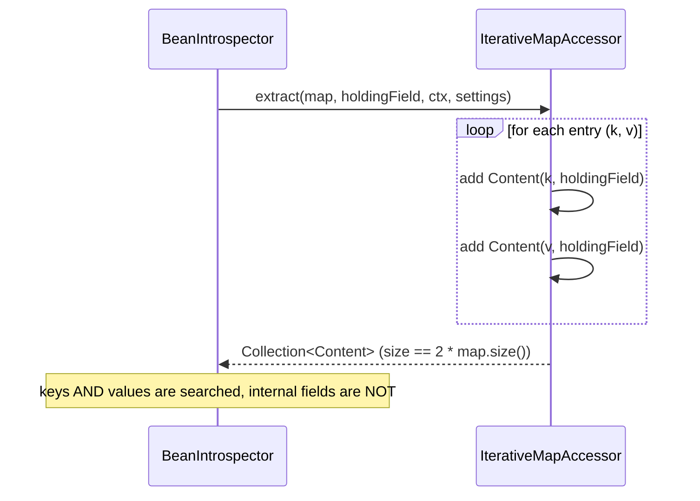

# IterativeMapAccessor

`IterativeMapAccessor` is the accessor specialized for **`java.util.Map`** instances. It exposes both
the **keys** and the **values** of the map as searchable content.

- Package: `systems.helius.commons.reflection.accessors`
- Accepts: any class assignable to `Map`.

---

## What it extracts

For each entry in the map, the accessor yields **two `Content` items** — one for the key and one for
the value — both paired with the map's own `holdingField`. Like `IterativeAccessor`, it treats the
map as a logical container and does **not** read the map's internal fields (buckets, table, size,
etc.).



---

## Examples

Both keys and values are reachable, so a search matches whichever side holds the target type:

```java
Map<String, Double> map = new HashMap<>();
map.put("alpha", 1.0);
map.put("beta",  2.0);

// Keys
Set<String> keys = introspector.seek(String.class, map, MethodHandles.lookup());
// -> { "alpha", "beta" }

// Values
Set<Double> values = introspector.seek(Double.class, map, MethodHandles.lookup());
// -> { 1.0, 2.0 }
```

---

## Access note

Reading map entries iterates the map's public API rather than its private fields, but the surrounding
introspection still operates under the active `IntrospectionSettings`. In particular, when unsafe
access is configured (`safeAccessCheck = false`) and the broader traversal cannot legally access a
value reached through the map, the search fails fast as documented in
[`BeanIntrospector`](../BeanIntrospector.md#error-handling).

Whether map entries are iterated (versus the map being deeply field-inspected) is controlled when
building the accessor chain via `AccessorsChain.Builder.iterateOverMapEntries(boolean)`.

---

## Behaviour summary

- Accepts any `Map`.
- Yields **both** keys and values (`2 * entryCount` items).
- Does **not** inspect the map's own internal fields.

